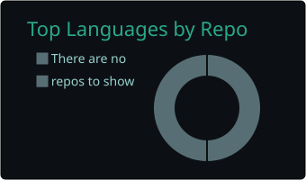
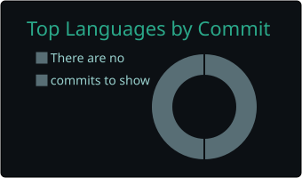

<h1 align="center">I'm KHALIL CHOUIKRI</h1>
<h3 align="center">Machine Learning • Deep Learning • Maritime Engineering</h3>

---

## About Me

Hello! I'm **Khalil Chouikri**, a PhD researcher at **Aix-Marseille University** working at the intersection of  
**machine learning, maritime engineering, and physics-based modeling**.

My work focuses on **ship power prediction**, **hybrid semi-parametric models**, and integrating **physics + AI** to push predictive performance beyond traditional approaches.

I love transforming complex engineering problems into **impactful, data-driven solutions**.

### What I Do  
I specialise in:

- Ship power prediction & maritime data modeling  
- ML/DL for engineering and applied physics  
- Hybrid physics-guided learning & semi-parametric models  
- Seakeeping analysis, resistance modeling & CFD-based insights  
- Scientific computing, model evaluation & engineering data pipelines  

### Let’s Connect  
Always open to research collaborations in **engineering, physics, ML/DL**, and applied sciences.  
You can reach me at **khalilchouikri@gmail.com**  
Portfolio: https://www.self.so/khalil-chouikri-y38xd5

---

## Skills

### AI / ML

  
  

### Development

  

### DevOps & MLOps

  

### Databases

  

### IDE

  

---

## Statistics

  
  

  
  <!-- 
   -->

### Streak stats

  

### GitHub Metrics

  

---

## Connect With Me

  
  
  

---
